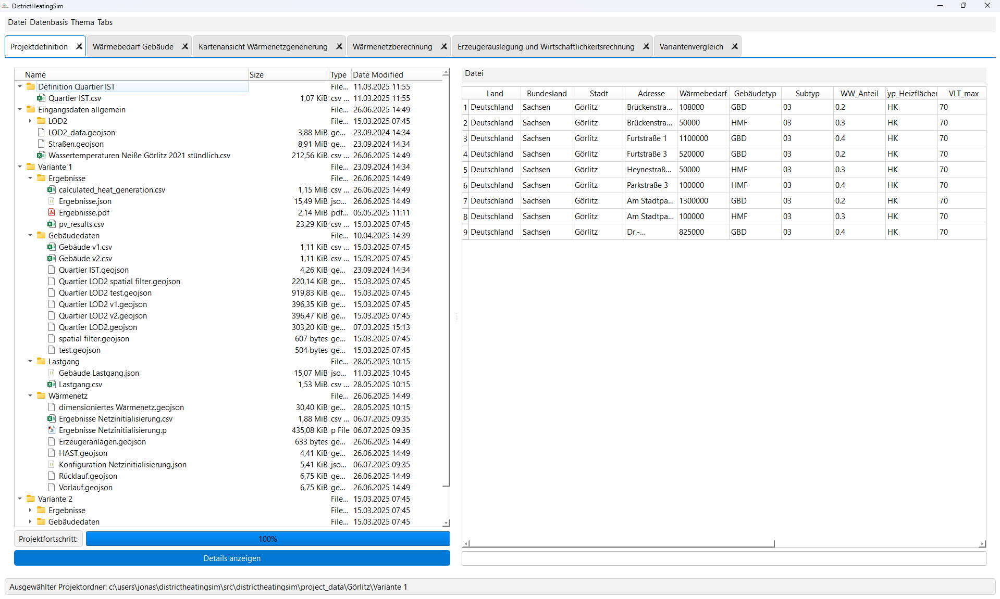
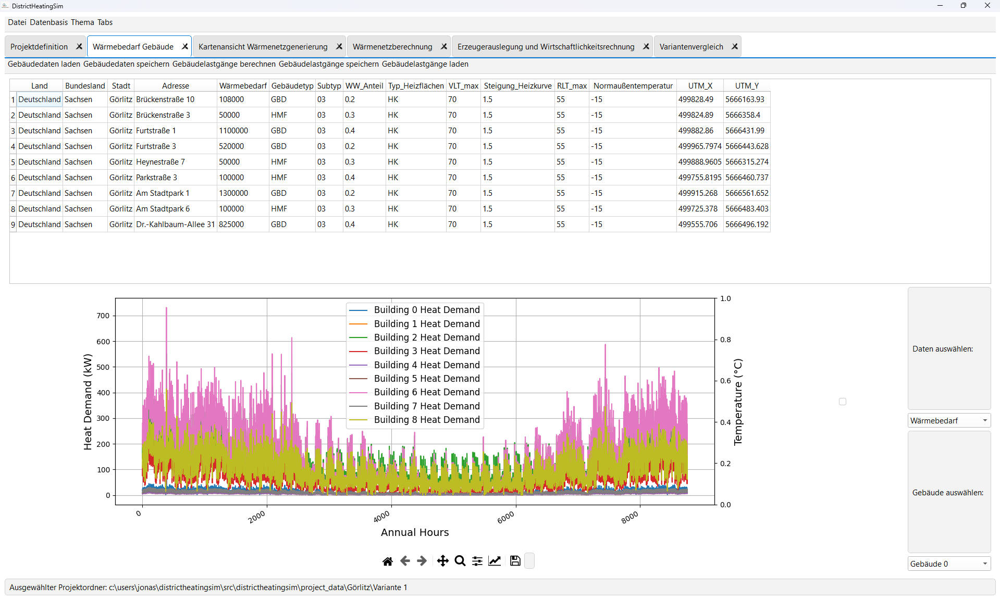
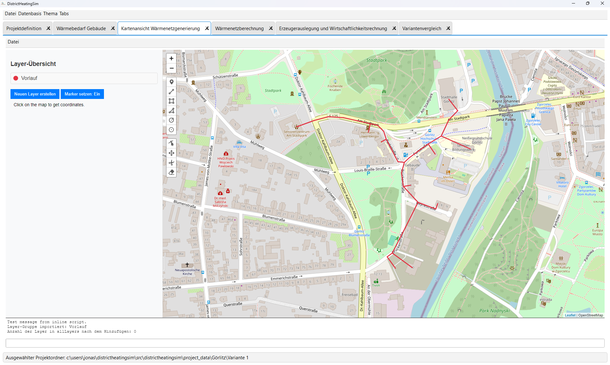
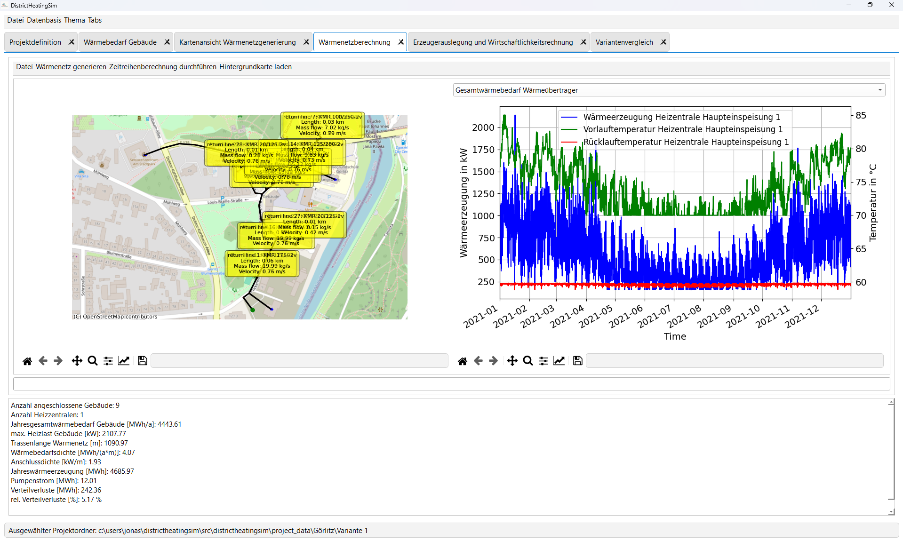
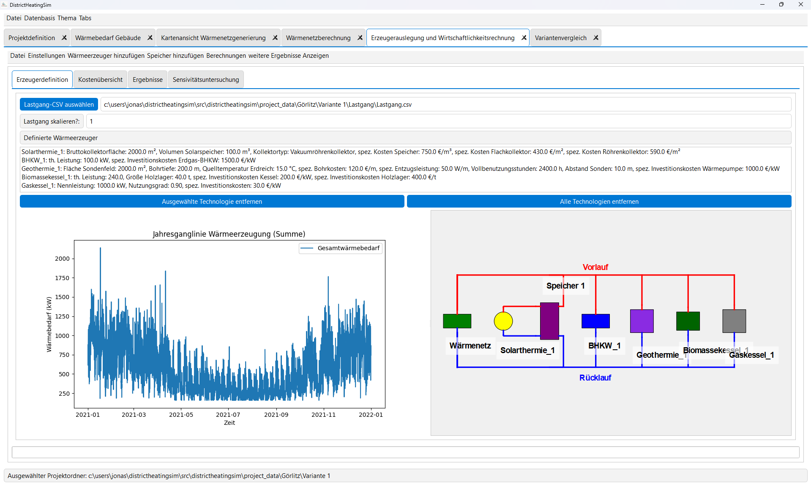

# DistrictHeatingSim

## Introduction

Welcome to the DistrictHeatingSim project, a comprehensive tool for planning and optimizing sustainable district heating networks. This README provides an overview of the project's functionality, installation instructions, and usage guidelines.

The software integrates technical and economic simulations to support the design and evaluation of district heating systems. Besides the technical methods for calculations, a huge focus lies on implementing a GUI for this process steps. The Tool is implemented as an PyQt6-GUI.

DistrictHeatingSim was originally developed at the University of Applied Science Zittau/Görlitz by Dipl.-Ing. (FH) Jonas Pfeiffer as part of a preliminary research SMWK-NEUES TG70 project, which focuses on the development and testing of methods and tools for the conceptualization of sustainable heating networks. The work is now being continued within an EFRE-ESF founded "Nachwuchsforschergruppe Energiespeicher" at the University of Applied Science Zittau/Görlitz.

## Table of Contents
1. [Features](#features)
2. [Installation](#installation)
3. [Usage](#usage)
    - [Spatial Analysis](#spatial-analysis)
    - [Heat Network Calculation](#heat-network-calculation)
    - [Generator Sizing and Economic Analysis](#generator-sizing-and-economic-analysis)
4. [Requirements](#requirements)
5. [Project Structure](#project-structure)
6. [Contribution Guidelines](#contribution-guidelines)
7. [License](#license)
8. [Contact Information](#contact-information)

## Features

### User Interface
- **Project Definition**: Create project folders, your data input and track your project progress
- **Building Heat Demand Profile Calculation**: Calculate the heat demand profiles for your buildings based on BDEW SLPs (Standard Load Profiles)
- **Geocoding**: Convert addresses to coordinates and visualize them on a map.
- **OSM Data Integration**: Download and process OpenStreetMap data for streets and buildings.
- **Automatic Heat Network Generation**: Generate heating networks based on building and generator locations.
- **GIS Data Handling**: Uniformly manage and store GIS data in the GeoJSON format.
- **Thermohydraulic Network Calculation**: Simulate the generated heat networks with [pandapipes](https://github.com/e2nIEE/pandapipes).
- **Cost Calculation**: Calculate heat generation costs based on [VDI 2067](https://www.vdi.de/richtlinien/details/vdi-2067-blatt-1-wirtschaftlichkeit-gebaeudetechnischer-anlagen-grundlagen-und-kostenberechnung-1) methodology and various cost inputs.
- **Save/Load Project Results**: Integrated options to save and load calculated results in main parts of the software

### Technical Capabilities
- **Heat Requirement Calculation**: Calculate heat demands based on different profiles and weather data.
- **Economic Scenario Analysis**: Evaluate the economic feasibility of various heating scenarios.
- **Optimization Algorithms**: Optimize heating network configurations for cost efficiency.
- **Integration of Renewable Technologies**: Support for solar thermal, biomass, geothermal, and other renewable sources. Also includes the AqvaHeat technology, partly developed by Hochschule Zittau/Görlitz, for efficient heat distribution.

## Installation

To install DistrictHeatingSim, follow the steps below. The software has been tested with Python 3.11. Ensure that you have Python installed on your system before proceeding. Alternatively, you can use Miniconda for managing dependencies.

### Option 1: Install via pip
1. Open a terminal or command prompt.
2. Install the repository directly from GitHub using the following command:
    ```sh
    pip install git+https://github.com/JonasPfeiffer123/DistrictHeatingSim.git
    ```

### Option 2: Manual Installation
1. Clone the repository to your local machine:
    ```sh
    git clone https://github.com/JonasPfeiffer123/DistrictHeatingSim.git
    ```
2. Navigate to the project directory:
    ```sh
    cd DistrictHeatingSim
    ```
3. Install the required dependencies using the `setup.py` file:
    ```sh
    python setup.py install
    ```
    Alternatively, you can use pip to install the package:
    ```sh
    pip install .
    ```
4. Run the application by executing the main script:
    ```sh
    python src/districtheatingsim/DistrictHeatingSim.py
    ```

> **ℹ️ Note - Custom Pipe Types:**  
> Additional pipe types have been added and must be included by replacing the `Pipe.csv` in `pandapipes/std_types/library` with the `Pipe.csv` located in `DistrictHeatingSim/src/districtheatingsim/data/pandapipes/pipes`.

### Troubleshooting
- If you encounter errors during installation or while running the application, ensure that all required Python modules are installed. You can install the dependencies listed in the `requirements.txt` file:
    ```sh
    pip install -r requirements.txt
    ```
- Verify that all necessary data files are present in the appropriate directories.
- If issues persist, please report them on the [GitHub Issues page](https://github.com/JonasPfeiffer123/DistrictHeatingSim/issues) with detailed information about the error.

By following these steps, you should be able to successfully install and run DistrictHeatingSim on your system.

## Usage

Start DistrictHeatingSim by running DistrictHeatingSim.py within src/districtheatingsim/



### Building Heat Demand Profile Calculation

1. **Load CSV-File**: Create/Load CSV-file with project specific building informations.
2. **Choose Profiles**: Choose profiles for these building if not defined previously.
3. **Calculate Profiles**: Calculate the profiles based on weather data.
4. **View in Diagram**: Results are shown in the diagramm and saved as JSON



### Spatial Analysis

1. **Load Project**: Start the application and select or create a new project.
2. **Geocoding**: Use the built-in tool to convert address data in CSV format to coordinates.
3. **OSM Data**: Download and integrate street and building data from OpenStreetMap.
4. **Heat Network Generation**: Automatically generate a heat network based on building and generator locations.



### Heat Network Calculation

1. **Load Data**: Import the generated heat network data into Pandapipes.
2. **Simulation**: Perform thermohydraulic calculations to simulate the heat network.
3. **Optimization**: Optimize the network for cost efficiency and operational performance.
4. **Results**: Visualize the results, including flow rates, pressures, and temperatures.



### Generator Sizing and Economic Analysis

1. **Define Parameters**: Set up economic parameters and cost factors.
2. **Generator Configuration**: Configure different types of heat generators and their capacities.
3. **Simulation**: Simulate the performance and cost of different heating scenarios.
4. **Report Generation**: Generate a PDF report with the simulation results, economic analysis, and recommendations.



## Requirements

- **Python Version**: >= 3.11, < 3.12 (some libraries currently not working with Python 3.12; only tested with Python 3.11)
- Required Python packages listed in `requirements.txt`:
    ```text
    PyQt6
    PyQt6-WebEngine
    matplotlib
    pandapipes>=0.13.0
    pandapower
    geopandas
    folium
    scipy
    geopy
    overpy
    geojson
    scikit-learn
    requests
    CoolProp
    contextily
    plotly
    seaborn
    ```

## Project Structure

- **src/districtheatingsim**: Source code for DistrictHeatingSim
- **docs/**: Documentation for DistrictHeatingSim
- **examples/**: Contains multiple Examples for the various base functionalities of the software.
- **images/**: Contains examples of the GUI
- **requirements.txt**: List of dependencies
- **README.md**: This README file

## PyInstaller
Pyinstaller installation works with specific definitions. Reach out to the author for further intructions.

## Documentation
The Code is documented with docstrings which are readable by [Sphinx](https://www.sphinx-doc.org/en/master/) and therefore a documentation can be created by running

1. **Install Sphinx**:
    ```sh
    pip install sphinx
    ```

2. ***Install "readthedocs" theme**:
    ```sh
    pip install sphinx_rtd_theme
    ```

3. **Navigate to the docs folder**:
    ```sh
    cd docs
    ```

4. **Generate the .rst-files**:
    ```sh
    sphinx-apidoc -f -o source/ ../src/districtheatingsim
    ```

5. **Build the HTML documentation**:
    ```sh
    make clean
    make html
    ```

The current version of the documentation can be found under https://districtheatingsim.readthedocs.io/en/latest/. The Sphinx-compatible documentation was created with Copilot using Claude Sonnet 4.5.

### Documentation Style Guide

To ensure consistency across the codebase, all Python code should follow these documentation standards:

**Docstring Format**: Sphinx/reStructuredText (reST)

**Required Elements**:
- **Summary**: Brief one-line description of the function/class
- **Parameters**: Description of all parameters (use `:param:` and `:type:`)
- **Returns**: Description of return values (use `:return:` and `:rtype:`)
- **Raises**: Exceptions that may be raised (use `:raises:`)

**Example**:
```python
def calculate_heat_demand(building_area, building_type, weather_data):
    """
    Calculate the heat demand for a building based on area, type, and weather data.
    
    :param building_area: Area of the building in square meters
    :type building_area: float
    :param building_type: Type of building (e.g., 'residential', 'commercial')
    :type building_type: str
    :param weather_data: Weather data for the calculation period
    :type weather_data: pd.DataFrame
    :return: Calculated heat demand profile
    :rtype: pd.Series
    :raises ValueError: If building_area is negative or building_type is invalid
    
    .. note::
        This function uses BDEW standard load profiles for the calculation.
    """
    pass
```

**Guidelines**:
- Keep docstrings concise but informative
- Document all public functions, classes, and methods
- Use type hints in function signatures where possible
- Add examples for complex functions using `.. code-block::` or doctest format

## Publication

**Supporting the Transformation of Heat Supply: Development of a Software Solution for Sustainable Heating Networks**  
Jonas Pfeiffer, Matthias Kunick
**Published in:** *Proceedings of the 25th Young Scientists Conference*  
Hochschule Merseburg, 2025, pp. 128–132  
[📎 View PDF](https://www.hs-merseburg.de/fileadmin/Forschung/Nachwuchswissenschaftlerkonferenz/NWK25/NWK25_Tagungsband.pdf)

**Development of an integrated software workflow for district heating network planning: A structured methodological approach**  
Jonas Pfeiffer, Matthias Kunick  
**Published in:** *ACC Journal*, 31(1), 48–63, 2025  
[https://doi.org/10.2478/acc-2025-0004](https://doi.org/10.2478/acc-2025-0004)

## Contribution Guidelines

I welcome contributions from the community. To contribute:

1. Fork the repository.
2. Create a new branch for your feature or bug fix.
3. Make your changes and commit them with descriptive messages.
4. Push your changes to your forked repository.
5. Open a pull request to the main repository.

Please ensure that your contributions align with the project's coding standards and add tests for new functionalities.

## Known Issues and Future Work

For a list of known issues, planned features, and ongoing development tasks, please refer to:
- [GitHub Issues](https://github.com/JonasPfeiffer123/DistrictHeatingSim/issues)
- [todo.md](todo.md) for internal development notes

## License

DistrictHeatingSim is licensed under the GPL v3 License. See the `LICENSE` file for more details.

## Funding Notice

This project is funded by the Free State of Saxony as part of the SMWK-NEUES TG70 initiative. The funding supports the development and testing of methods and tools for the conceptualization of sustainable heating networks.


## Contact Information

For further information, questions, or feedback, please contact the project maintainer:

Dipl.-Ing. (FH) Jonas Pfeiffer

[GitHub Profile](https://github.com/JonasPfeiffer123)  

Email: jonas.pfeiffer(at)hszg.de

[LinkedIn](https://de.linkedin.com/in/jonas-pfeiffer-0357691a2)

