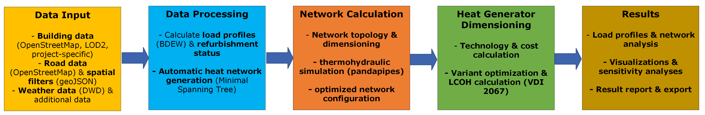
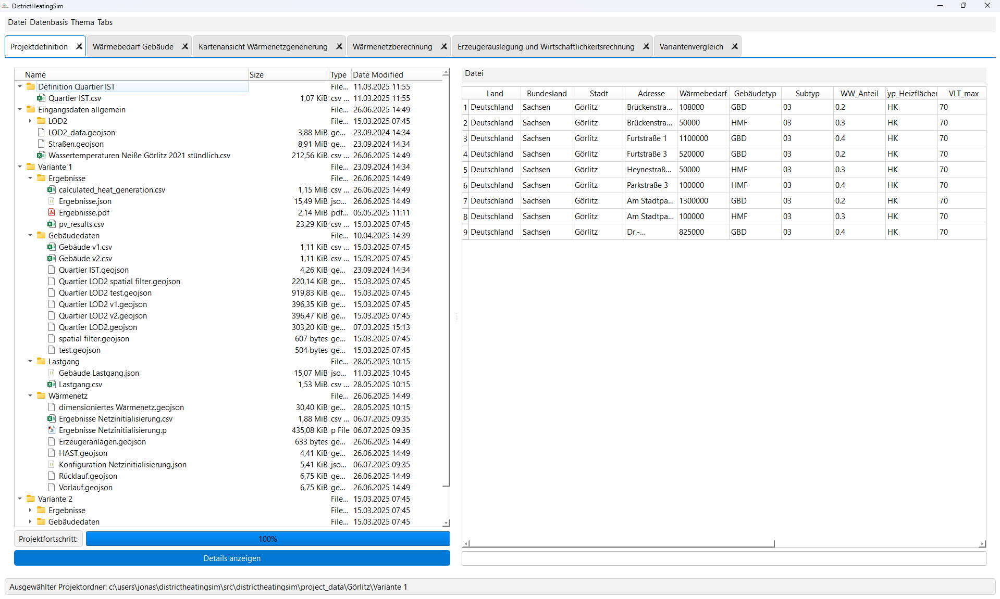
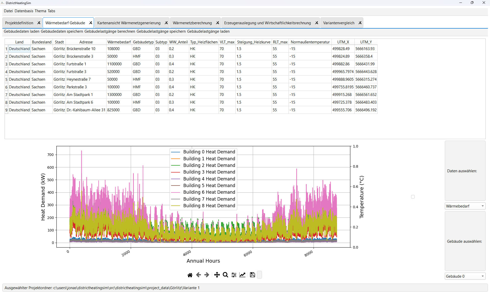
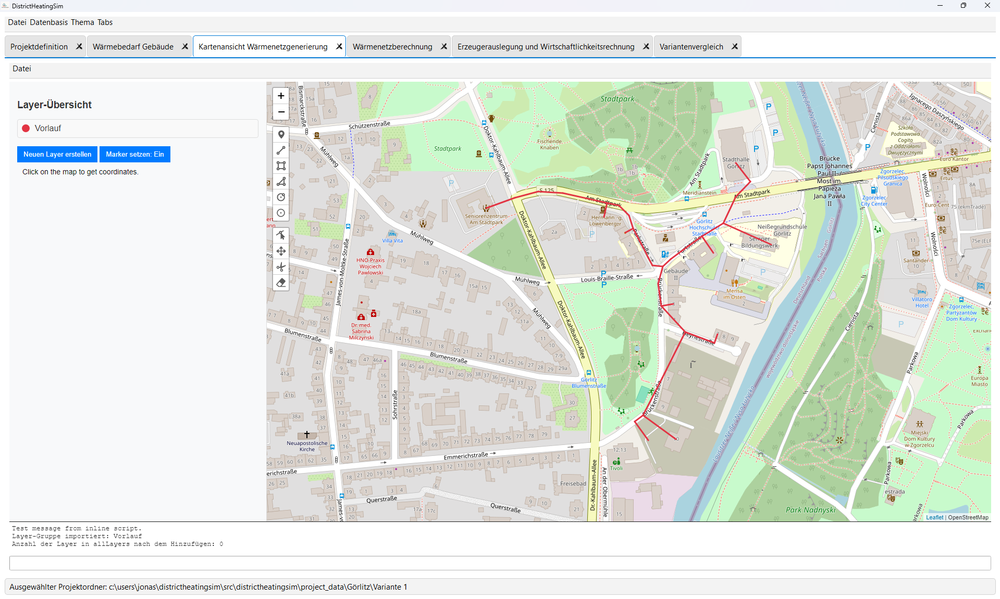
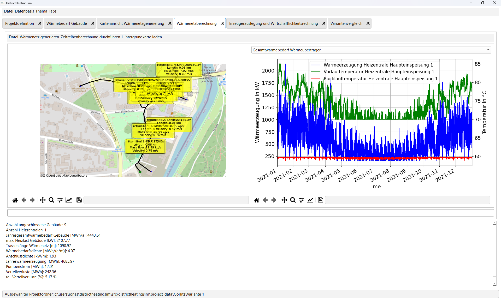
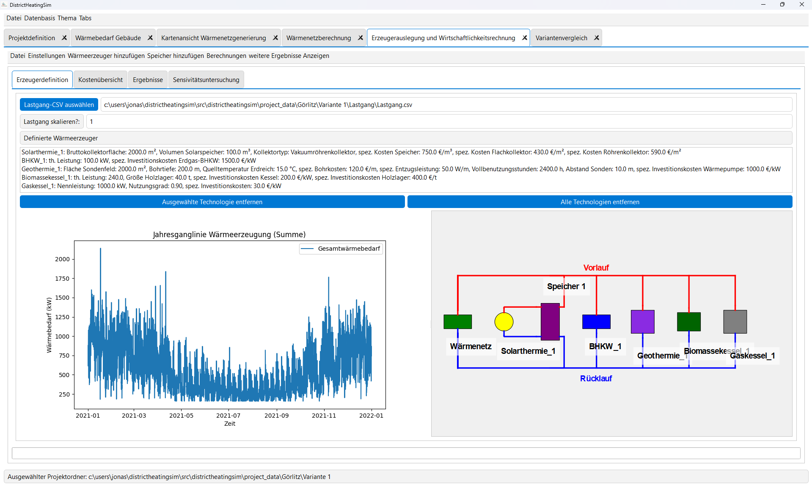

DistrictHeatingSim Documentation
=================================

.. image:: https://img.shields.io/badge/version-0.1.0-blue.svg
   :alt: Version

.. image:: https://img.shields.io/badge/python-3.11%2B-blue.svg
   :alt: Python Version

**DistrictHeatingSim** is a comprehensive simulation tool for district heating systems with GUI-based user interface and advanced calculation algorithms.

   **Figure 1:** DistrictHeatingSim software workflow showing the integrated approach
   for district heating network planning and analysis.

📋 Key Features
---------------------

.. grid:: 2

   .. grid-item-card:: 🏗️ Network Generation
      :text-align: center
      
      Automated heating network topology from OpenStreetMap data

   .. grid-item-card:: 🏠 Building Modeling
      :text-align: center
      
      LOD2 building data and heat demand calculations

   .. grid-item-card:: ⚡ Energy Systems
      :text-align: center
      
      Heat pumps, CHP, solar and power-to-heat systems

   .. grid-item-card:: 📊 Simulation
      :text-align: center
      
      Thermo-hydraulic simulation with pandapipes

   **Figure 2:** Project management interface for organizing and managing district heating projects.

   **Figure 3:** Building load profiles based on building data and weather conditions.

   **Figure 4:** Interactive map visualization of district heating networks using Leaflet.

   **Figure 5:** Thermo-hydraulic simulation of district heating networks using pandapipes.

   **Figure 6:** Definition of heat generation systems including heat pumps and CHP units.

🛠️ Installation
-----------------

.. code-block:: bash

   pip install districtheatingsim
   
   # Or for development:
   git clone https://github.com/jonaspfeiffer123/DistrictHeatingSim.git
   cd DistrictHeatingSim
   pip install -e .

🚀 Quick Start
----------------

To start the application directly, run the following in the terminal:

.. code-block:: bash

   python src/districtheatingsim/DistrictHeatingSim.py

📚 Documentation
--------------------

.. toctree::
   :maxdepth: 3
   :caption: DistrictHeatingSim

   districtheatingsim

💡 Examples
--------------

The following examples demonstrate various aspects of the DistrictHeatingSim application. 
All example files are located in the ``examples/`` directory of the project repository.

.. grid:: 3

   .. grid-item-card:: 🚀 Getting Started
      :text-align: center
      
      Basic geocoding and data import examples
      
      See: ``01_example_geocoding.py``, ``02_example_import_osm_data_geojson.py``

   .. grid-item-card:: 🏠 Building Analysis
      :text-align: center
      
      Heat demand calculations and LOD2 processing
      
      See: ``03_example_simple_heat_requirement.py``, ``04_example_data_heat_requirement.py``, ``11_example_lod2.py``

   .. grid-item-card:: 🌐 Network Design
      :text-align: center
      
      Network generation and optimization
      
      See: ``05_example_net_generation.py``, ``10_example_heat_generation_optimization.py``

   .. grid-item-card:: ⚡ Energy Systems
      :text-align: center
      
      Heat generators and seasonal storage
      
      See: ``09_example_heat_generators.py``, ``17_energy_system_seasonal_storage.py``

   .. grid-item-card:: 📊 Simulation
      :text-align: center
      
      Pandapipes simulation and time series analysis
      
      See: ``06_example_simple_pandapipes.py``, ``07_example_timeseries_pandapipes.py``, ``08_example_complex_pandapipes_timeseries.py``

   .. grid-item-card:: 💰 Economic Analysis
      :text-align: center
      
      Renovation analysis and financial calculations
      
      See: ``12_example_renovation_analysis.py``, ``15_example_annuity.py``

.. toctree::
   :maxdepth: 3
   :caption: Examples
   :glob:
   
   examples

📋 Example Data
----------------

Examples use various data sources and formats:

- **Geographic Data**: OpenStreetMap data, building coordinates
- **Building Data**: LOD2 models, heat demand parameters
- **Weather Data**: TRY (Test Reference Year) files
- **System Data**: Heat pump performance curves, generator specifications
- **Network Data**: Pipe specifications, node configurations

Some examples generate their own test data, while others may require external data files from the ``examples/data/`` directory.

🤝 Community & Support
-----------------------

- 🐛 **Bug Reports**: `GitHub Issues <https://github.com/jonaspfeiffer123/DistrictHeatingSim/issues>`_
- 💬 **Discussions**: `GitHub Discussions <https://github.com/jonaspfeiffer123/DistrictHeatingSim/discussions>`_
- 📖 **Examples**: `GitHub Examples <https://github.com/jonaspfeiffer123/DistrictHeatingSim/tree/main/examples>`_

.. toctree::
   :maxdepth: 3
   :caption: Development

   references

Indices and Tables
==================

* :ref:`genindex`
* :ref:`modindex`
* :ref:`search`